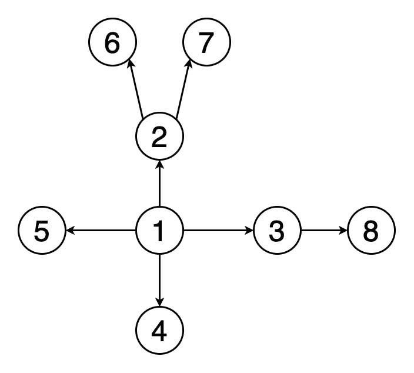

# Routing Application
Routing application is responsible for calculating possible land routes from one country to another.

## Technologies
- [Java 11](https://docs.oracle.com/en/java/javase/11/)
- [Spring Boot Framework](https://spring.io/projects/spring-boot) (2.7.6)

## Algorithm Description
Route building is done using **Breadth-first search (BFS)** algorithm. This algorithm gives opportunity to find the shortest path from one node to another in graph.
The idea of this algorithm is to explore all neighbour vertices on the same depth for particular vertex before going to vertex in next level:



BFS algorithm uses _Queue_ to store vertices that need to be visited.

## Setup
### Local environment pre-requirements
- Install Java 11
- Install Maven 3.6+

## Getting Started
1. Clone the repository:
```
git clone https://github.com/SN4NTR/RoutingApplication.git
```
2. Go to folder with project and build it:
```
mvn clean package
```
3. Run application:
```
mvn spring-boot:run
```
4. Send test request:
```
curl --location --request GET 'http://localhost:8080/routing/CZE/ITA'
```